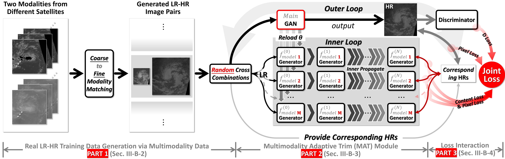

# MMTCSR

### Overview
This repository is a PyTorch implementation of Remote Sensing Image Super-Resolution of Tropical Cyclone in Multimodal Environment.

### Abstract

From the perspective of traditional super-resolution dataset construction, using artificial downsampling techniques, unfortunately, suffers from the drawbacks of information loss, insufficient diversity, and non-uniqueness. Meanwhile, existing methods for image super-resolution are limited to single-modal images and cannot accommodate the complexities of multimodal images. Diverse modal data necessitates individualized model design and training, hindering the exploitation of complementary relationships among multimodal data. Our work addresses the issues above by undertaking a two-step solution approach. The initial step involves the construction of a super-resolution dataset that utilizes remote sensing images of tropical cyclones in “real cases”. This dataset comprises HR-LR image pairs originating from multiple sensors of varying satellite sources resulting in multimodal data. However, the HR-LR image pairs suffer from an additional misalignment issue. In the second step, a superresolution network based on MAT is designed to address the multimodal characteristics and misalignment problems. After numerous ablation experiments and comparison experiments, the effectiveness of our model has been shown to improve by 50% over the original baseline model, with an increase varying between 20% and 50% compared to other common super-resolution models. Our source code and data are publicly available online at https://github.com/kleenY/MMTCSR.

### Motivation

### Introduction to Catalog Files

1. my_utils folder contains the project's tool files.

   - cal_index is used to calculate metrics; 

   - cal_lpips is used to calculate lpips metrics; 

   - data_split is used to partition the data set; 

   - data_extract is used to extract data and process the data; 

   - draw_data, heatmap, numpy_to_ image are used to display the data.

2. The results folder contains our results file.

3. The utils folder contains our hyperparameter configuration files.

   - parser_utils file to configure hyperparameters (most important);

   - the dataset_tools file to help configure the dataset;

   - storages file to help with configuration file storage.

4. Main Documents:

   - data file for data processing, normalization and other operations;
   - discriminator file is the discriminator module of the paper;
   - experiment_builder file for building the experimental framework;
   - inner_loop_optimizers file is the inner loop auxiliary file of the model;
   - loss file mainly contains the code for content loss calculation;
   - maml_tcsr file is the module for the outer loop of the model;
   - meta_tcsr_architecture is used to build the entire model training framework;
   - my_RDN_modle is a CNN generator chosen for our network, this module can be replaced with any other module to improve the performance；
   - mydataset is used to build the dataset for pytorch deep learning training;
   - mytest for model testing;
   - train for model training;
   - transform is used for data enhancement operations, including operations such as flipping;
   - model is the model we trained and can be used to test.

### Network Structure Diagram

### Experimental results

Results of network module ablation experiments

Comparison of experimental results

### How to use

1. using a super-resolution dataset of remote sensing images of real multimodal tropical cyclones that we uploaded;
2. run the train file to train the model;
3. the hyperparameters are set in the parser_utils file in the utils folder;
4. testing with the mytest file after the training is completed;
5. use the image display file under the my_utils folder to convert the results into images for observation. you can use the metrics calculation file under the my_utils folder to calculate the metrics between the results and the real images.

### Citations

If MMTCSR helps your research or work, please consider citing MMTCSR.

Tao Song, Kunlin Yang, Fan Meng, Xin Li, Handan Sun, Chenglizhao Chen. China University of Petroleum (East China).

[kleenY/MMTCSR (github.com)](https://github.com/kleenY/MMTCSR)

### Contact

If you have any question, please email `ikunyang14@163.com`.
